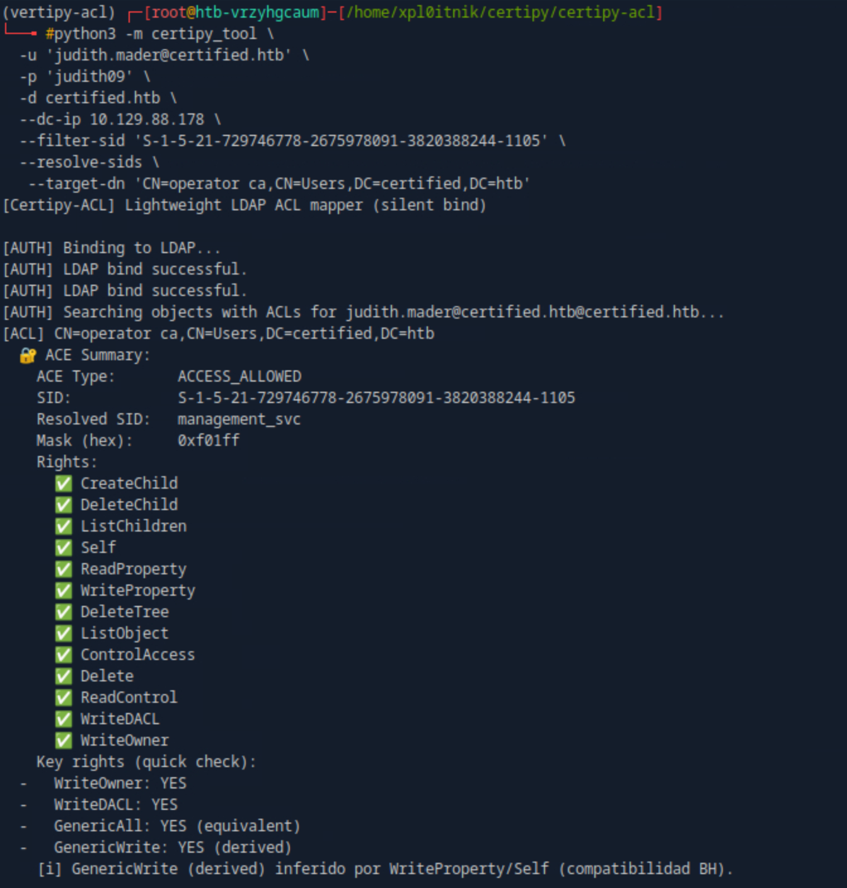

# Certipy-ACL — Stealthy LDAP ACL enumeration for AD

[](https://github.com/xploitnik/certipy-acl/actions/workflows/ci.yml)

A small CLI that binds once to LDAP and prints **real ACEs** from DACLs (e.g., **WriteOwner**, **WriteDACL**, **GenericAll**, **GenericWrite**). It complements Certipy by focusing on quiet, precise ACL reads—no graph simulation or transitive guessing.

- Single LDAP bind → fetches `nTSecurityDescriptor` only where you ask  
- Filter by **SID** (user/group) to see exactly *who controls what*  
- Scope by **object** (`--target-dn`) or **subtree** (`--enum-base`)  
- Focus output on **escalation rights** (`--only-escalation`, `--hits-only`)  
- Optional **SID resolution**, **LDAPS**, and **size limits** for OPSEC  

---

## Install

```bash
pip install -e .
# Requires Python 3.8+, ldap3>=2.9, impacket>=0.11.0
```

> Also works as a module: `python -m certipy_tool --help`

---

## Quickstart & Commands
Basic enumeration
```
certipy-acl \
  -u 'user@domain.local' -p 'Password' \
  -d domain.local --dc-ip 10.0.0.10 \
  --resolve-sids
```

Surgical: filter a trustee on a specific object
```
certipy-acl \
  -u 'user@domain.local' -p 'Password' \
  -d domain.local --dc-ip 10.0.0.10 \
  --target-dn 'CN=SomeUser,CN=Users,DC=domain,DC=local' \
  --filter-sid 'S-1-5-21-...-RID' \
  --only-escalation --hits-only --resolve-sids
```

Target a subtree (e.g., CN=Users only)
```
certipy-acl \
  -u 'user@domain.local' -p 'Password' \
  -d domain.local --dc-ip 10.0.0.10 \
  --enum-base 'CN=Users,DC=domain,DC=local' \
  --filter-sid 'S-1-5-21-...-RID' \
  --only-escalation --hits-only --resolve-sids --size-limit 1000
```

## Choose your stealth level (at a glance)

| Level | Scope | OPSEC | Typical use |
|---:|---|---|---|
| 🟢 Low | Single SID / object | ✅ High | See what a specific user/group controls |
| 🟡 Medium | One OU / container | ⚠️ Medium | Recon in a bounded subtree |
| 🔴 High | Whole domain | ❌ Low | Full privilege map (HTB/CTF or authorized audits) |

More tactics & OPSEC tips: **[🎭 Stealth Playbook](docs/stealth-playbook.md)**

---

## What you’ll see

<a href="docs/images/acl_writeowner_judith_management.png">
  
</a>

<a href="docs/images/acl_Generic_All.png">
  
</a>

---

## Flags you’ll actually use (90% cases)

- `--target-dn '<DN>'` — limit to a **single object** (quote the DN)  
- `--enum-base '<DN>'` — limit enumeration to a **subtree/OU**  
- `--filter-sid '<SID>'` — show ACEs where **trustee == SID** (user/group)  
- `--only-escalation` — focus on **WriteOwner, WriteDACL, GenericAll, GenericWrite**  
- `--hits-only` — hide entries without matches (clean output)  
- `--check-writeowner` — quick pass to surface **WriteOwner** only  
- `--size-limit N` — process only the first **N** objects  
- `--ldaps` — use LDAP over TLS (636) if available  
- `--resolve-sids` — resolve SIDs to names via LDAP (slower, more readable)  
- `--verbose` — print extra diagnostics  

Run `certipy-acl --help` for the full list.

---

## Docs

- Setup & Usage: `docs/guides/setup_usage_guide.md`  
- Usage Strategy: `docs/guides/usage_strategy.md`  
- 🎭 Stealth Playbook: `docs/stealth-playbook.md`  
- Project Structure: `docs/reference/project_structure.md`  
- Known Issues: `docs/known_issues.md`  
- Case Study (BloodHound vs Certipy-ACL): `docs/case-studies/bloodhound_vs_certipyacl.md`  
- Changelog: `docs/releases/CHANGELOG.md`

---

## Contributing

PRs welcome. Please add/keep a simple test in `tests/` and ensure CI is green.

**License:** MIT  
**Credits:** Thanks to @ly4k (Certipy) for inspiration.


