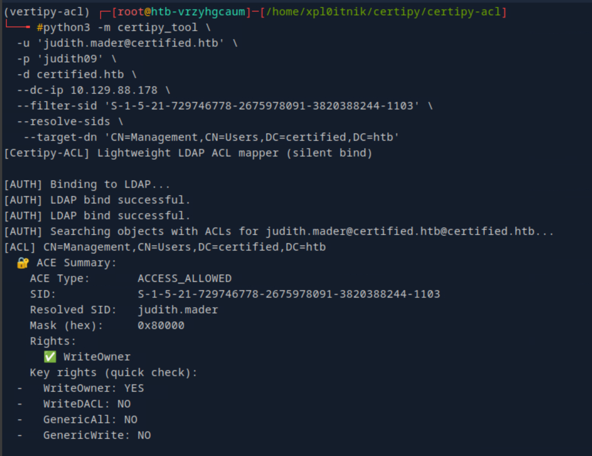

# Certipy-ACL — Stealthy LDAP ACL enumeration for AD

[](https://github.com/xploitnik/certipy-acl/actions/workflows/ci.yml)

A small CLI that binds once to LDAP and prints **real ACEs** from DACLs (e.g., **WriteOwner**, **WriteDACL**, **GenericAll**, **GenericWrite**). It complements Certipy by focusing on quiet, precise ACL reads—no graph simulation or transitive guessing.

---

## Install

```bash
pip install -e .
# Requires Python 3.8+, ldap3>=2.9, impacket>=0.11.0
```

---

## Quickstart

```bash
# Basic enumeration
certipy-acl \
  -u 'user@domain.local' -p 'Password' \
  -d domain.local --dc-ip 10.0.0.10 \
  --resolve-sids --hits-only
```

```bash
# Filter a trustee on a specific object
certipy-acl \
  -u 'user@domain.local' -p 'Password' \
  -d domain.local --dc-ip 10.0.0.10 \
  --target-dn 'CN=SomeUser,CN=Users,DC=domain,DC=local' \
  --filter-sid 'S-1-5-21-...-RID' \
  --resolve-sids --hits-only
```

> Also works as a module: `python -m certipy_tool --help`

---

## What you’ll see


*Example output highlighting WriteOwner.*


*Parity with BloodHound for common escalation paths (case study).*

---

## Flags you’ll actually use (90% cases)

- `--target-dn` — limit search to a DN/subtree (quote the DN)
- `--filter-sid` — show ACEs where trustee == SID
- `--resolve-sids` — resolve SIDs to names via LDAP
- `--hits-only` — only show escalation-relevant rights
- `--check-writeowner` — quick boolean check (requires `--target-dn` + `--filter-sid`)
- `--size-limit N` — process only the first N objects
- `--ldaps`, `--verbose`

Run `certipy-acl --help` for the full list.

---

## Troubleshooting (OpenSSL 3 / MD4 on Arch/Athena)

If you hit:
```
[ERROR] Falló el bind LDAP: unsupported hash type MD4
```

Enable the legacy provider **for this session only**:

```bash
cat > ~/.openssl-legacy.cnf <<'EOF'
openssl_conf = openssl_init
[openssl_init]
providers = provider_sect
[provider_sect]
default = default_sect
legacy  = legacy_sect
[default_sect]
activate = 1
[legacy_sect]
activate = 1
EOF

OPENSSL_CONF=$HOME/.openssl-legacy.cnf \
python -m certipy_tool --help
```

---

## Docs

- Setup & Usage: `docs/guides/setup_usage_guide.md`  
- Usage Strategy: `docs/guides/usage_strategy.md`  
- Project Structure: `docs/reference/project_structure.md`  
- Known Issues: `docs/known_issues.md`  
- Case Study (BloodHound vs Certipy-ACL): `docs/case-studies/bloodhound_vs_certipyacl.md`  
- Changelog: `docs/releases/CHANGELOG.md`

---

## Contributing

PRs welcome. Please add/keep a simple test in `tests/` and ensure CI is green.

**License:** MIT  
**Credits:** Thanks to @ly4k (Certipy) for inspiration.


